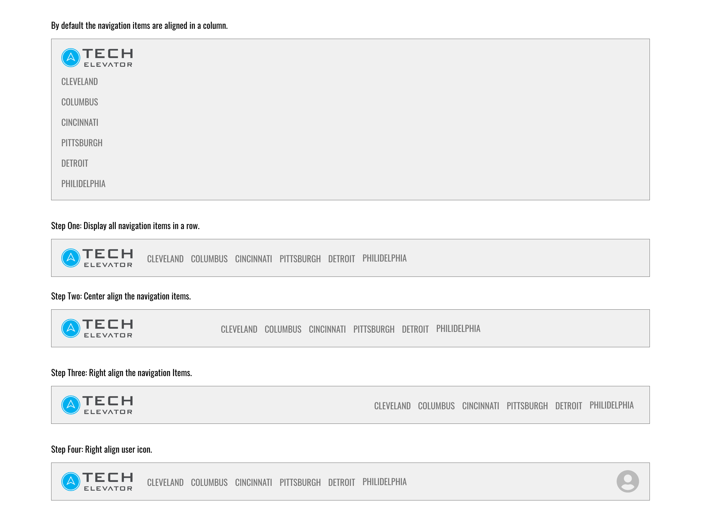
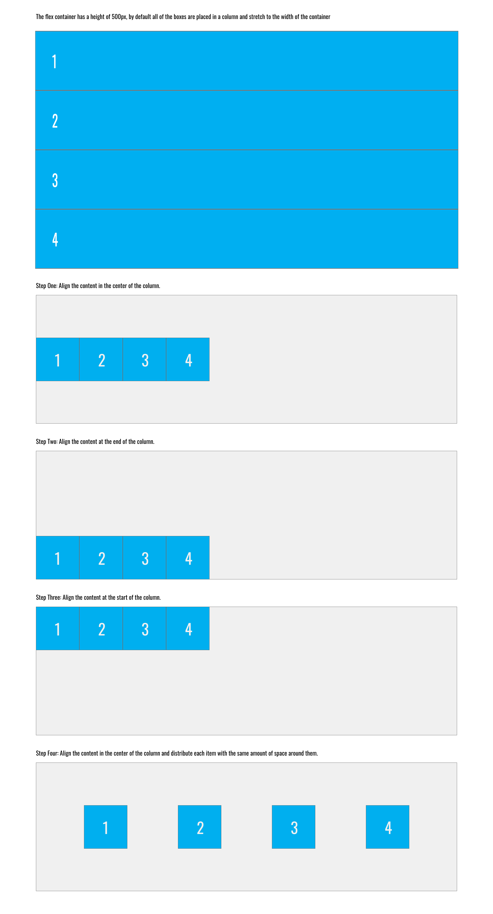

# Practice with flexbox properties

This is a collection of exercises to practice working with flexbox containers and flex item properties. These are some of the same exercises that you have done before.

## Before you begin

The purspose of this exercise is not to have you individually complete each of the exercises, rather it is to have you learn how to split the work into separate tasks that are to be completed by separate team members.

There are 8 individual tasks. Each team member should be assigned 1 specific tasks to complete. The remaining tasks should be used to demonstrate and practice resolving merge conflicts.

# The Tasks

## Adjust header layout

In the header exercises, you'll align several navigation items.

### Task 1
`header/step-1`: Display all navigation items and logo in a row.

### Task 2
`header/step-2`: Step one changes, and center align the navigation items.

### Taks 3
`header/step-3`: Step one changes, and right align the navigation items.

### Task 4
`header/step-4`: Step one changes, and right align the user icon by setting `.spacer` to take up the rest of the available space.

## Align flex items in a column

In this exercise, you'll align several flex items within a column.

### Task 5
`align-content-column/step-1`: Align the content in the center of the column.

### Task 6
`align-content-column/step-2`: Align the content at the end of the column.

### Task 7
`align-content-column/step-3`: Align the content at the start of the column.

### Task 8
`align-content-column/step-4`: Align the content in the center of the column, and distribute each item with the same amount of space around them.

